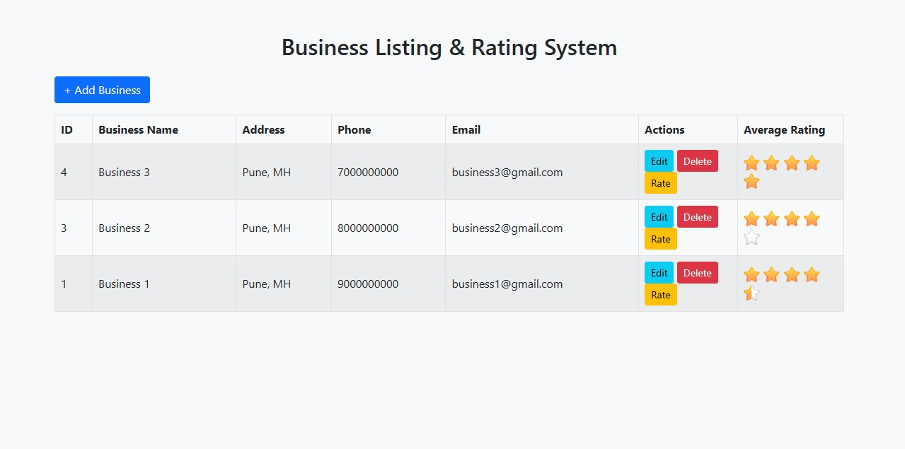

# Business Listing & Rating System  
### PHP + MySQL + jQuery + AJAX + Bootstrap + Raty Plugin  

This project is built according to the **NADSOFT Machine Test Requirements**.  
It implements:

- Business Listing (CRUD)
- AJAX-based Add/Edit/Delete (No page refresh)
- Rating system using [**jQuery Raty Plugin**](https://www.jqueryscript.net/demo/Full-featured-Star-Rating-Plugin-For-jQuery-Raty/)
- Half-star rating supported
- Average Rating auto-update after each rating submission
- Clean UI with Bootstrap 5

---

## 🚀 Features

### 1. Business Listing
- Shown in table format
- Shows ID, Business Info, Actions, and Average Rating

### 2. CRUD (Create / Update / Delete)
- Add & Edit in Bootstrap Modal
- Delete with confirmation
- All actions update table instantly (AJAX)

### 3. Rating System
- Clicking rating icon opens Rating Modal
- Name, Email, Phone, Rating required
- If Email OR Phone already exists for the same business:
  → **Update rating**
- Otherwise:
  → **Insert new rating**
- After submit:
  → Table reloads via AJAX  
  → Average rating recalculated

### 4. No Page Refresh  
All operations use AJAX.

---

## 📂 Folder Structure

business-rating-system/
├── index.php
├── add_business.php
├── update_business.php
├── delete_business.php
├── fetch_business.php
├── fetch_single_business.php
├── rating_submit.php
│
├── includes/
│ ├── db.php
│ └── functions.php
│
├── assets/
│ ├── css/bootstrap.min.css
│ ├── js/jquery.min.js
│ ├── js/bootstrap.bundle.min.js
│ ├── js/jquery.raty.js
│ └── images/
│ ├── star-on.png
│ ├── star-off.png
│ └── star-half.png
│
└── sql/
└── database.sql

---

## 🛠️ Setup Instructions

### Step 1: Create Database
Import the SQL file: `sql/database.sql` into your database.

Database name: **business_rating**


### Step 2: Configure DB Connection  
Open: `includes/db.php`

Set your MySQL credentials:

```php
$conn = mysqli_connect("localhost", "root", "", "business_rating_system");
```


### Step 3: Place the Project in Localhost
Example:
`htdocs/business-rating-system/`


### Step 4: Open in Browser
http://localhost/business-rating-system/

Everything will load automatically.


### Step 5: Raty Plugin Setup
Place these files inside: `assets/images/`

Download Star Images:
🔗 star-on.png
🔗 star-off.png
🔗 star-half.png

(These are included in the standard Raty plugin package)

Raty JS file: `assets/js/jquery.raty.js`


### Step 6: CSS Setup
Place these files inside: `assets/css/`

Download Bootstrap CSS:
🔗 bootstrap.min.css


### Step 7: JS Setup
Place these files inside: `assets/js/`

Download Bootstrap JS:
🔗 bootstrap.bundle.min.js
🔗 jquery.min.js

Download Raty JS:
🔗 jquery.raty.js

---

## 📌 AJAX Endpoints

| File                      | Description           |
| ------------------------- | --------------------- |
| add_business.php          | Add business          |
| update_business.php       | Edit business         |
| delete_business.php       | Delete business       |
| fetch_business.php        | Reload table          |
| fetch_single_business.php | Get single business   |
| rating_submit.php         | Insert/Update ratings |

---

## 📝 Requirements Checklist (All Completed)

- [✔] Core PHP (NO framework)
- [✔] MySQL Database
- [✔] jQuery + AJAX
- [✔] Bootstrap Modal
- [✔] Raty Plugin with half-star support
- [✔] Real-time updates
- [✔] Clean UI
- [✔] Email/Phone overwrite rule
- [✔] No page refresh
- [✔] Full CRUD completed
- [✔] SQL file included

---

## 📸 Screenshots



---

## 📝 License

 [](https://opensource.org/licenses/MIT)

---

## 👨‍💻 Developer

**Developed by: [**Taufik Khatik**](https://taufikkhatik.netlify.app)**

**Hosted by: [**NADSOFT**](https://www.nadsoftdev.com)**

---